# 唐僧叨叨后台管理

### 介绍 📖

唐僧叨叨后台管理一款基于 Vue3.3、TypeScript、Vite5、Pinia、Element-Plus 开源的后台管理框架，使用目前最新技术栈开发；是唐僧叨叨业务管理后台。

- 使用 Vue3.3 + TypeScript 开发，单文件组件＜script setup＞
- 采用 Vite 作为项目开发、打包工具（配置 gzip/brotli 打包、tsx 语法、跨域代理…）
- 使用 Pinia 替代 Vuex，轻量、简单、易用，集成 Pinia 持久化插件
- 使用 TypeScript 对 Axios 整个二次封装（请求拦截、取消、常用请求封装…）
- 支持 Element 组件大小切换、多主题布局、暗黑模式、i18n 国际化
- 使用 VueRouter 配置动态路由权限拦截、路由懒加载，支持页面按钮权限控制
- 使用 KeepAlive 对页面进行缓存，支持多级嵌套路由缓存
- 常用自定义指令开发（权限、复制、水印、拖拽、节流、防抖、长按…）
- 使用 Prettier 统一格式化代码，集成 ESLint、Stylelint 代码校验规范
- 使用 husky、lint-staged、commitlint、czg、cz-git 规范提交信息

### 安装使用步骤 📔

环境变量
- NODE_ENV node环境变量
- APP_ENV 应用环境变量
  - dev 开发环境
  - pord 生产环境
- IS_CONFIG 是否添加配置文件

1. 安装

```sh
pnpm install
```

2. 本地开发

``` sh
pnpm dev
```

3. 编译

``` sh
pnpm build
```

4. 配置文件编译

``` sh
pnpm build:config
```

5. 本地预览
> 先执行编译再执行该命令

``` sh
pnpm serve
```

### 功能特色 🔨

- [x] 首页
  - [x] 仪表盘
  - [x] 主题设置
- [x] 用户
  - [x] 新增用户
  - [x] 用户列表
    - [x] 发消息
    - [x] 好友列表
    - [x] 封禁
  - [x] 封禁用户列表
    - [x] 封禁
    - [x] 解禁
- [x] 群组
  - [x] 群列表
      - [x] 发消息
      - [x] 群成员
      - [x] 聊天记录
      - [x] 黑名单成员
      - [x] 禁言
      - [x] 封禁
  - [x] 封禁群列表
- [x] 消息
  - [x] 消息记录
  - [x] 违禁词列表
- [x] 举报
  - [x] 举报用户
  - [x] 举报群聊
- [x] 工具
  - [x] APP升级
- [x] 设置
  - [x] 通用设置
  - [x] 修改登录密码
### 功能截图 📷


- 首页

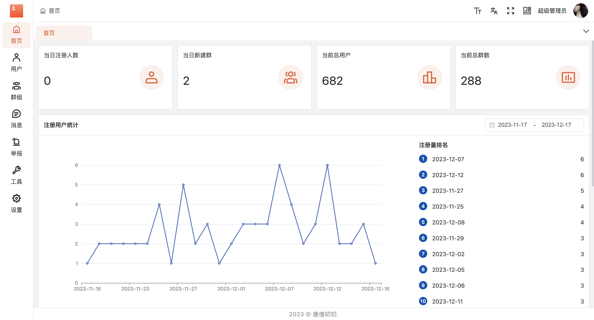

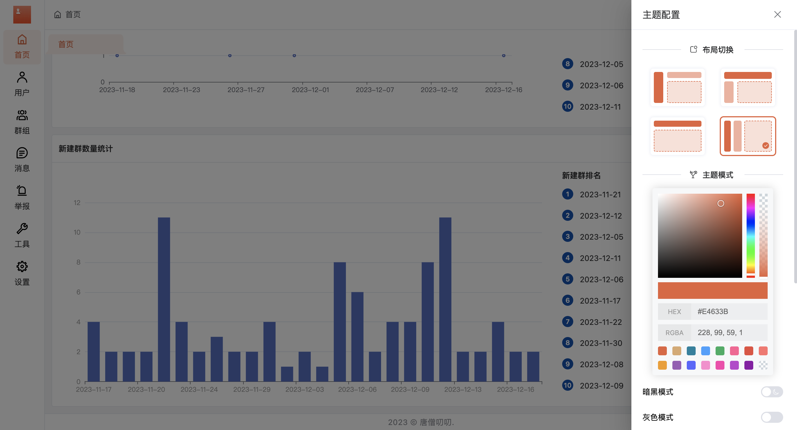


- 用户

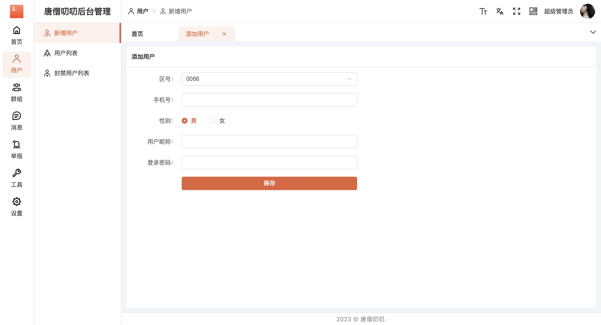

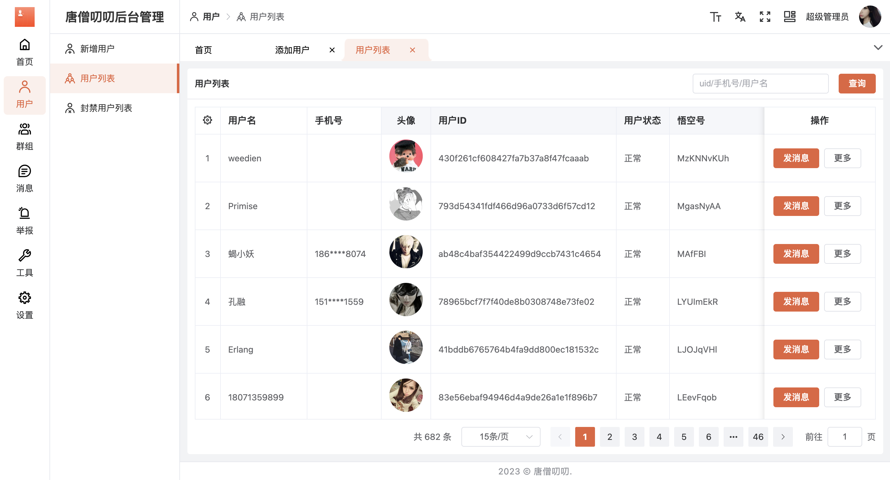


- 群组

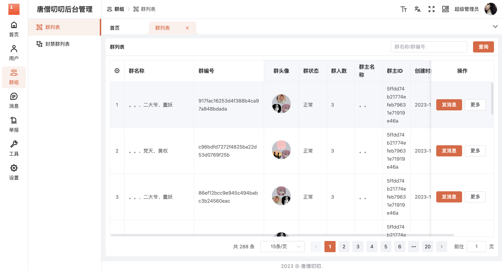

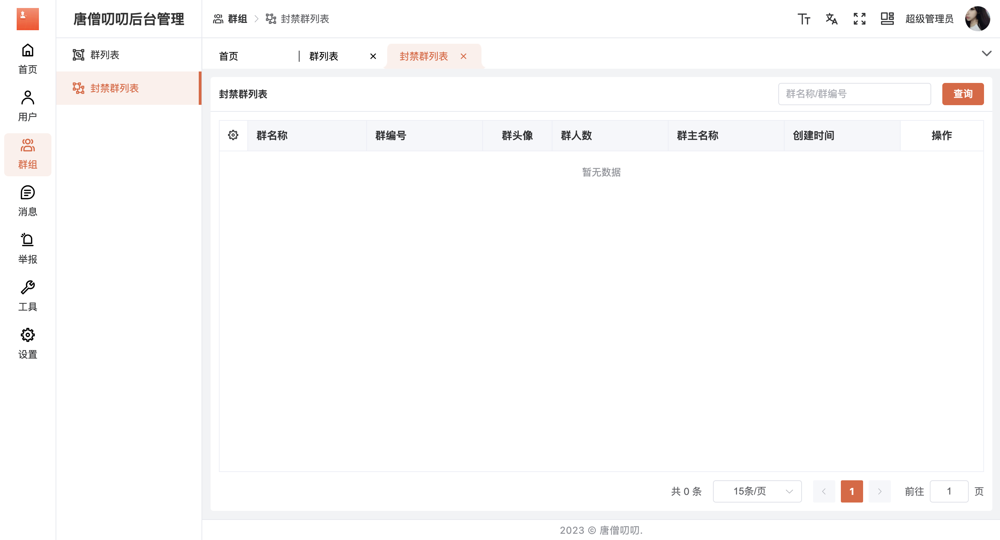

- 消息

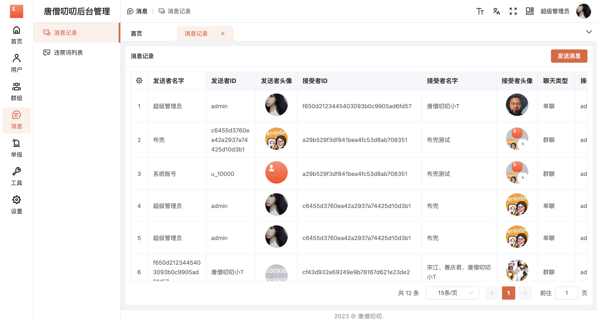

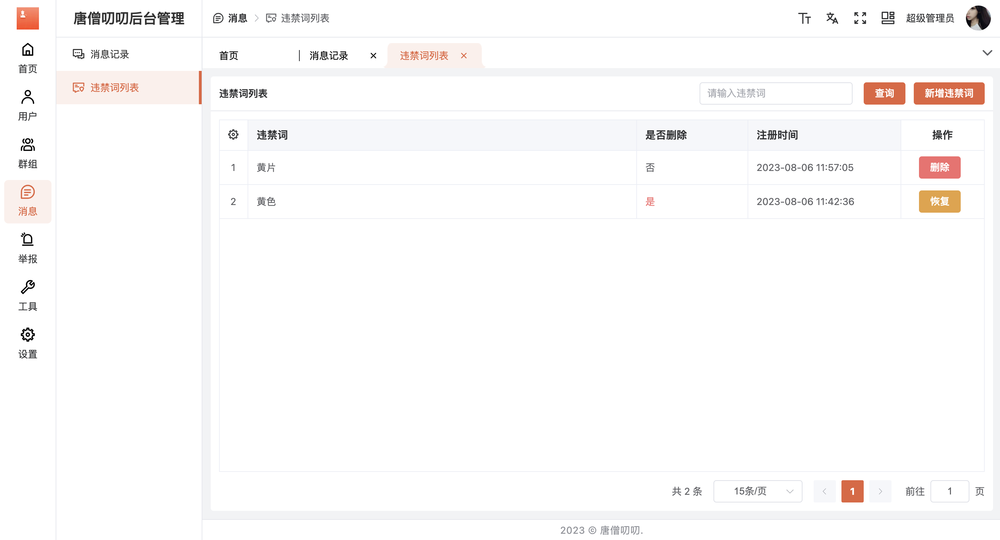

- 举报

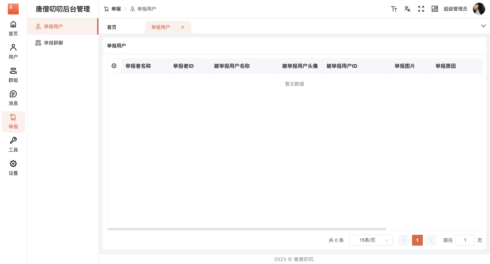


- 工具

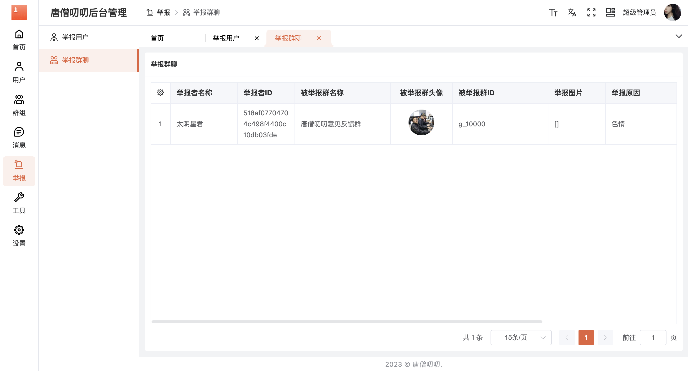

- 设置

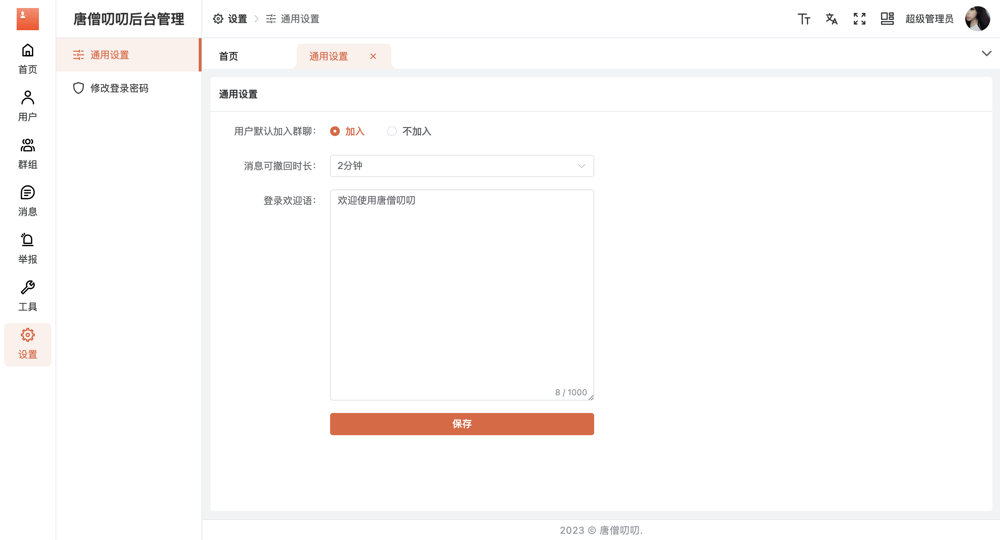

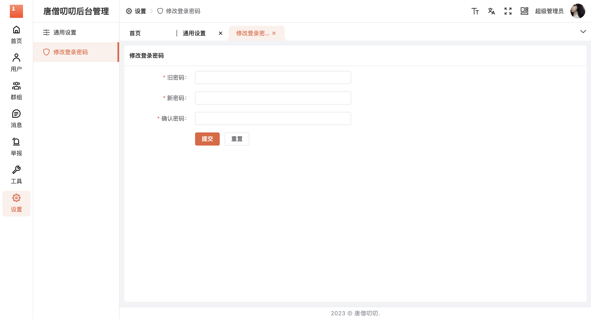
